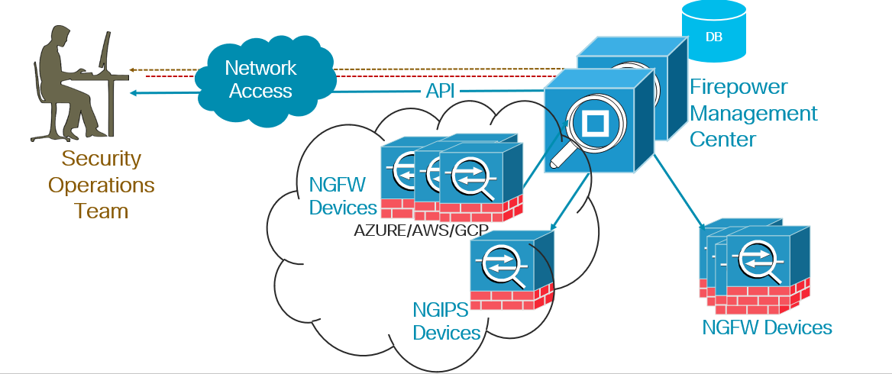
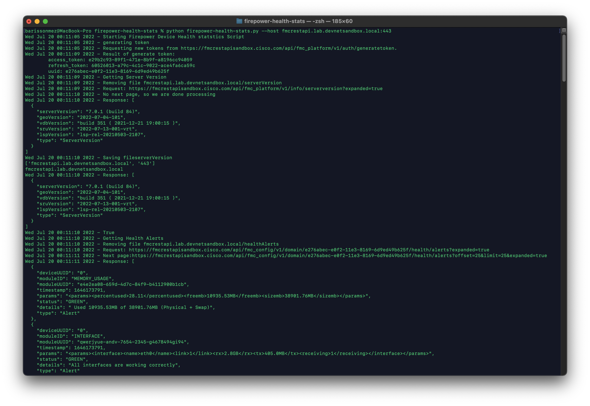
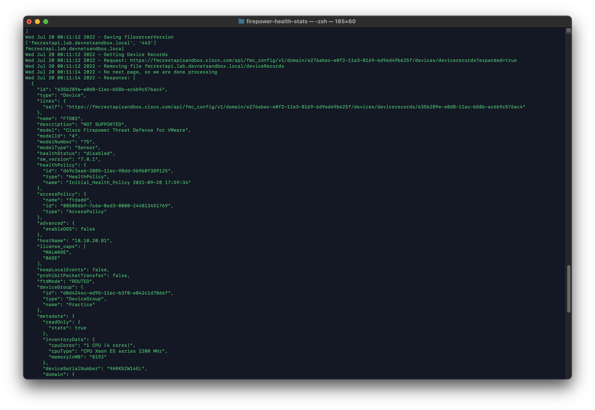
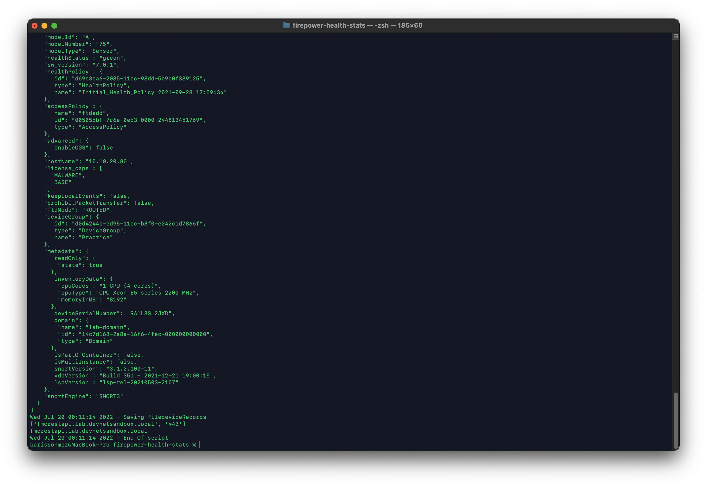

# Firepower Management Center Health Stats

Hunting down the IPS and Firewall devices status and health statistics for an security operation engineering team is always been very challenging but virtual and cloud environment deployments makes it even more harder to keep track of your devices statuses. This use case is only can be best handled via automation. 
Cisco Firepower Management Center (FMC) REST APIs enable this use case to be automated. 

Here you will find a python script which can collect health stats from FMC, irrespective of your deployment (On Premise, pure Cloud VPCs or Hybrid deployment). 
As long as network route available to your FMC, script will be able to collect device health stats.

### Usage:
##### Set the environment for the script 
`$export username=apiuser` make sure you provide the valid FMC username 
#
`$export password=password#12342%` make sure your provide the FMC user password
##### Execute the script to collect health stats
`$python FMC_Health.py --host myfmc-hostname:port`

